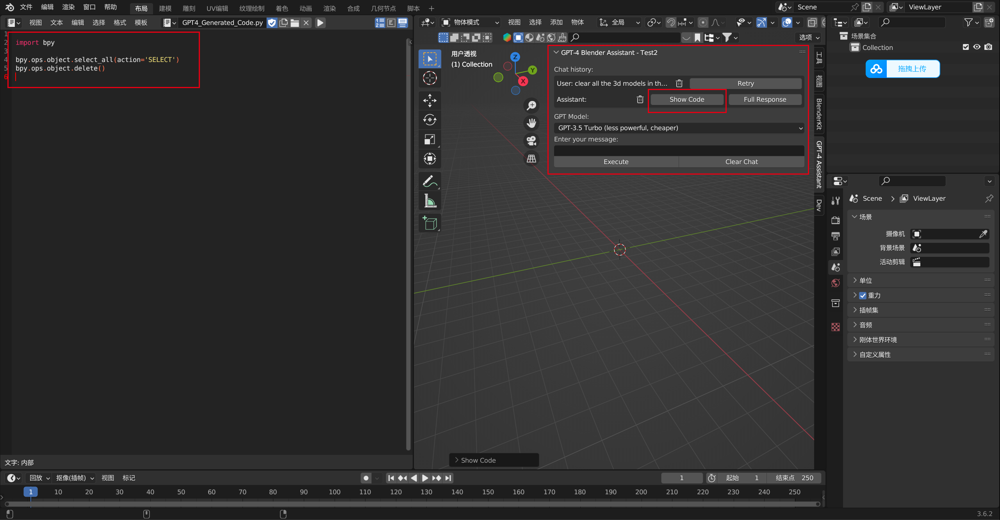

# CADgpt

code origin: https://github.com/gd3kr/BlenderGPT

blender addons tut: https://www.youtube.com/watch?v=dm5T5aOIO8Y

Details: https://www.notion.so/39bddbd5e74c48088a0676d543f9f3d7?v=692dbffd41b24464a1417f97bbfa9bfd&pvs=4

## Installation:

1. Clone this repository by clicking `Code > Download ZIP` on GitHub
2. Open Blender, go to `Edit > Preferences > Add-ons > Install`
3. Select the downloaded ZIP file and click `Install Add-on`
4. Enable the add-on by checking the checkbox next to `GPT-4 Blender Assistant`
5. Paste your OpenAI API key in the Addon preferences menu.
5. To view the code generations in realtime, go to `Window > Toggle System Console`

## Usage

1. In the 3D View, open the sidebar (press `N` if not visible) and locate the `GPT-4 Assistant` tab
2. Type a natural language command in the input field, e.g., "create a cube at the origin"
3. Click the `Execute` button to generate and execute the Blender Python code

## Example
clear all object in this scene

create a cube at the origin

check the code generated by GPT

check the full response 

## For developer

### vscode
install `Blender Development` plugin for blender addons development in vscode.